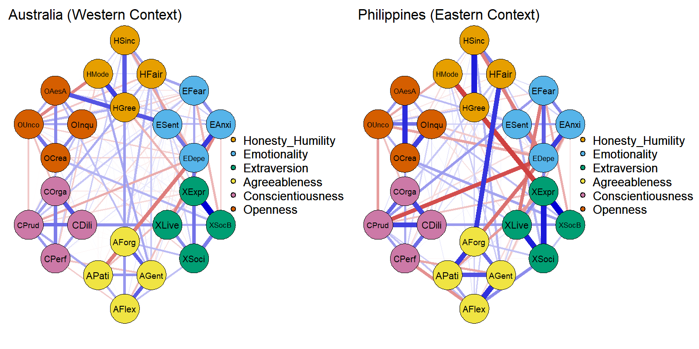

# Advanced Psychometric Network Analysis (PNA): A Cross-Cultural Case Study

## 📌 Project Overview

This repository represents a comprehensive psychometric workflow. While traditional **Confirmatory Factor Analysis (CFA)** and **Structural Equation Modeling (SEM)** are provided as foundational benchmarks, this project primarily focuses on **Psychometric Network Analysis (PNA)** as a "step-beyond" methodology.

The HEXACO dataset was selected as a robust benchmark to demonstrate high-dimensional data cleaning, Gaussian Graphical Model (GGM) estimation, and structural invariance testing across diverse populations.

Note on Research Focus: While this repository utilizes the HEXACO personality framework, it serves primarily as a methodological showcase for Psychometric Network Analysis (PNA). My core interest lies in the development and application of advanced statistical models and data engineering pipelines within psychometrics, rather than personality theory itself.

### Why Network Analysis?
Traditional latent variable models (CFA/SEM) assume that an underlying factor causes the observed behaviors. In contrast, the **Network Perspective** treats personality as a system of autonomous, interacting components. By moving from SEM to PNA, we can:
1. Identify **Bridge Facets** that connect different personality domains.
2. Evaluate **System Stability** beyond simple global fit indices.
* Explore **Cross-Cultural Dynamics** by analyzing how specific behavioral "feedback loops" vary between nations.

Using open-source data, this study estimates, validates, and compares personality networks across distinct global contexts, contrasting the structural dynamics of samples from **Australia (Western/Anglo)** and the **Philippines (Eastern/Asian)**.

*Above: A Gaussian Graphical Model (GGM) of personality structure comparing Western (Australia) and Eastern (Philippines) samples, estimated via EBICglasso. Nodes represent HEXACO facets; edge thickness represents partial correlation strength.*

## 🔍 Key Findings

* **Network Invariance:** Network Comparison Tests (NCT) confirm that the global network architecture (the "skeleton") of personality is stable across these distinct cultural samples ($p > 0.05$ in M-statistic), supporting the robust nature of the HEXACO model.
* **Edge Heterogeneity:** Statistically significant differences ($p < 0.05$) exist in specific edge weights, reflecting distinct cultural nuances in how traits like *Social Boldness* and *Sentimentality* manifest within different societal norms.
* **Stability:** Hub facets maintain high centrality stability coefficients ($CS > 0.5$) across bootstrap samples, ensuring reliability.

## 🛠️ Tech Stack & Methodology

* **Estimation:** Gaussian Graphical Models (GGM) using the Graphic LASSO penalty via the `qgraph` and `bootnet` R packages.
* **Regularization:** EBIC selection was applied to minimize false positive edges, ensuring a sparse and interpretable network.
* **Invariance Testing:** Network Comparison Test (NCT) package was used to statistically compare structure, strength, and edges between countries.

---

## 📁 Repository Structure

* `data/`: contains information on where to access the original open-source data.
* `scripts/`:
    * `01_Network_Stability.R`: Script for bootstrapping, stability coefficients, and centrality estimation.
    * `02_Cross_Cultural_Comparison.R`: Script for NCT estimation and cross-cultural plotting.
* `output/`: High-resolution PDFs and images of the networks and stability analysis.

## 🚀 How to Run

1.  Clone this repository.
2.  Install required R packages: `bootnet`, `qgraph`, `NetworkComparisonTest`, `dplyr`.
3.  Load the raw data.
4.  Run scripts sequentially.
5.  A brief exemple of how data such as this can be presented to companies or labs can be found in the script `Example of Data Presentation (Shiny).R`
