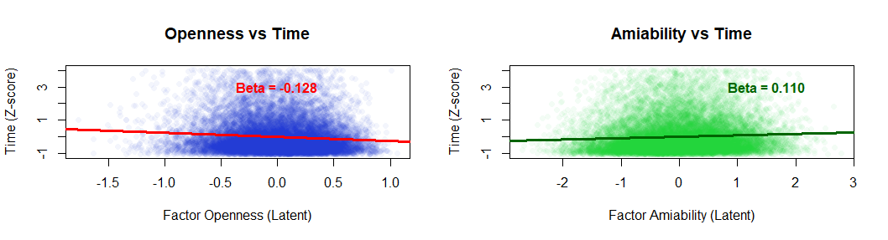

# HEXACO Personality Traits & Response Latency Analysis

### Project Overview
This study investigates the relationship between latent personality factors (based on the **HEXACO model**) and cognitive effort, using **response latency** (time taken to answer) as a proxy. 

Using a large-scale psychometric dataset ($N \approx 17,000$), I implemented **Structural Equation Modeling (SEM)** to validate the measurement model and analyze the structural paths between personality facets and response times. The rawdata was from https://openpsychometrics.org/_rawdata/, and initially had about ($N \approx 23,000$) answers

### Main Visualization

*Figure 1: Structural model showing the impact of personality facets on response latency.*

### Key Files
* **data-cleaning.R**: Script for data filtering, handling outliers, and Z-score normalization.
* **sem-analysis.R**: Implementation of the Confirmatory Factor Analysis (CFA) and SEM using the `lavaan` package.
* **[Openness-Amiability].png**: Visual representation of the model and its standardized coefficients.

### Technical Stack
* **Language:** R
* **Main Libraries:** `lavaan`, `psych`, `tidyverse`, `semPlot`.

### How to run
1. Clone the repository.
2. Ensure the required R libraries are installed (`install.packages("lavaan")`).
3. Run `HEXACO Cleaning Rawdata.R` before executing the SEM script to ensure the dataframe is correctly formatted.
